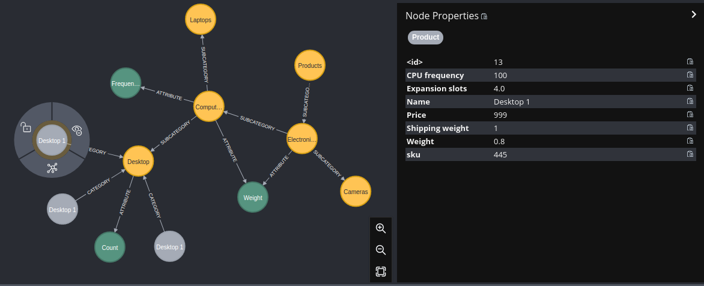

# NeoCatalogDesign

## Design

Two main folders in src corresponding to two different approaches:
- [`src/attr_in_neo`](src/attr_in_neo): 
  - Reference: https://neo4j.com/blog/modeling-categories-in-a-graph-database/

  

- [`src/attr_in_code`](src/attr_in_code): 
  - Reference: https://neo4j.com/graphgists/product-catalog/

  

To save time, I have used neomodel here instead of writing each Cypher query by hand.

(As an example, I have used the categories defined in 
https://neo4j.com/blog/modeling-categories-in-a-graph-database/)

## Usage

Requires `Python >= 3.9`

1. Install dependencies from `requirements.txt`. For instance:
   1. Create virtualenv: `python3 -m venv venv`
   2. Activate `source venv/bin/activate`
   3. Run `pip install -r requirements.txt`
2. Open [`./main.py`](main.py) and see instructions there
3. Run `python main.py`

**WARNING** the functions creating categories are not re-entrant
and should be run only once

To clean db:
```
// in neo attribute:
MATCH (n:Category) DETACH DELETE n
MATCH (n:Attribute) DETACH DELETE n
MATCH (n:Product) DETACH DELETE n
// in code attributes:
MATCH (n:CategoryV2) DETACH DELETE n
MATCH (n:ProductV2) DETACH DELETE n
```

## Limitations and remaining questions

- No performance check
- In approach 1 (attr in neo):
  - How to add constraints on attributes? (e.g.: weight < 10kg)
  - How to make sure attribute was not renamed before accessing its value in code (business logic)?
  - How to deal with attribute change (schema migration)?
- In approach 2 (attr in code):
  - How to model category-based constraints? (e.g.: CPU frequency required for products in 'Computers' category)
  - How to deal with the potentially large amount of attributes for a product? (most of them are nulls for each product)
